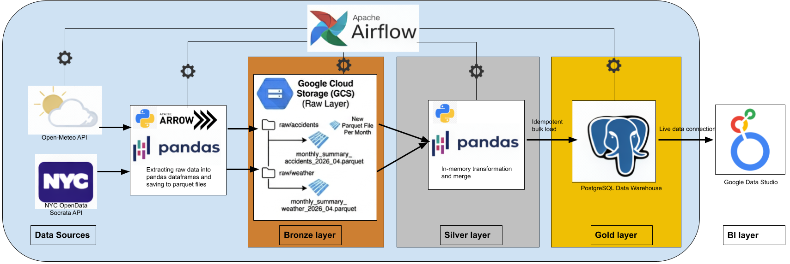

# NYC Traffic Accidents & Weather Correlation

### 📊 Project Overview and Goal
This project aims to find out is there any influence of different weather factors on the number of Traffic Accidents in New York City.

The Data Sources: 
- [Open-Meteo API](https://open-meteo.com/)
- [NYC Open Data](https://opendata.cityofnewyork.us/)
---

### 🗺️ Data Architecture Approach
It's a batch-processing pipeline implemented using ETL approach, where data is first extracted from two different sources (Open-Meteo API and NYCOpenData) and saved into a GCP bucket as structured Parquet files (raw layer). Then extracted from the bucket, transformed and combined into a single dataset entirely in memory using Pandas. And finally uploaded to a Postgres database which serves as a DWH. 
The pipeline organizes data through designated stages (lightweight medallion architecture). It establishes a raw/ directory in object storage acting as a Bronze Layer, loads data into memory for processing (Silver Layer), and outputs a highly optimized Gold Layer target table in the Data Warehouse.
The pipeline is orchestrated by Airflow. Onсe a month a dag is triggered that collects the data for the previous month and adds it to already existing data in the table. Data collection has been ongoing since January 2025.
Below is the visual representation of how data flows through the pipeline:

---

### 🏗️ Technology Stack
| Layer | Technology | Purpose |
| :--- | :--- | :--- |
| **Orchestration** | **Apache Airflow** | Core workflow management, task dependencies, and retries. |
| **Extraction** | **Python (Requests), sodapy** | Making scheduled requests to APIs |
| **Storage** | **Google Cloud Storage** | Acts as the staging layer storing historical monthly snapshots in compressed Parquet format. |
| **Data Warehouse** | **Postgres (Supabase)** | The final analytical layer serving clean query-ready data |
| **Transformation** | **Python (Pandas, PyArrow)** | Handles in-memory serialization, merging, schema alignment, and dataset formatting |
| **Presentation** | **Google Data Studio** | Connects directly to the PostgreSQL instance to provide stakeholder-facing dashboarding |

---
### 🚀 Workflow optimizations techniques
- Aggregations (like grouping accidents) are offloaded directly to the NYC OpenData Socrata API query engine, drastically minimizing network ingress and memory overhead on Airflow workers;
- The API aggregations reduce raw event-level data (individual car accidents) down to a daily frequency to match the grain of the weather metrics;
- Using parquet data format for efficient in-memory data processing, compression and columnar storage;
- Strict Idempotency: If the dag fails or is rerun for a historical month, the clear_data_before_inserting task wipes out data only for that specific month-year combination before executing the COPY statement. This prevents data duplication and ensures the DAG can be run safely multiple times;
- The target table uses a DATE variable as a PRIMARY KEY, optimizing time-series analytical queries;
---

### 🧠 Acquired Skills
- working with GCP tools such as Compute Engine and Cloud Storage;
- installing and working with Airflow to create an automated ETL data pipeline; 
- in-memory data manipulation using Pandas, working with Parquet file format;
- creating a dashboard in Google Data Studio (formerly Looker Studio)

